# Week 1 – IaaS Foundations with OpenStack

## Goal

Understand and operate Infrastructure-as-a-Service (IaaS) by setting up a single-node OpenStack with DevStack.

## How OpenStack Is Structured

OpenStack is a modular cloud platform composed of loosely coupled services that communicate via APIs. Each service is responsible for a specific infrastructure domain such as compute, networking, or storage.

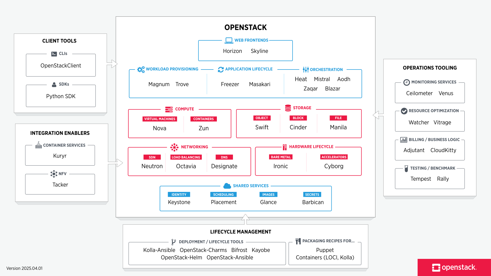

[OpenStack Platform](https://www.openstack.org/software/)

### Core Components Used

**Horizon:** Web-based UI for interacting with OpenStack services.

**Keystone:** Identity service providing authentication and authorization.
Manages users, projects, roles, and tokens

**Nova:** Compute service responsible for:

- Creating virtual machines
- Scheduling workloads
- Managing the VM lifecycle
- Deleting virtual machines

**Neutron:** Networking service providing:

- Networks
- Subnets
- Routing
- Floating IPs
- Security groups

**Glance:** Image service for storing and managing virtual machine images.

**Cinder:** Block storage service used to provide persistent volumes to instances.

**Placement:** Tracks resource inventories and allocations for Nova scheduling decisions.

### Supporting Services

**Swift:** Object storage service for storing unstructured data.

**Trove:** Database-as-a-Service (DBaaS) for managing relational and NoSQL databases.

**Magnum:** Service for deploying and managing container orchestration engines such as Kubernetes.

**Heat:** Orchestration service for automating the deployment of cloud applications using templates.

**Ceilometer:** Telemetry service for collecting usage and performance metrics.

## Installation and Basic Configuration

### Single-node OpenStack using DevStack

This setup uses DevStack to deploy a functional OpenStack environment on a single node for learning and validation purposes.

[DevStack Installation](https://docs.openstack.org/devstack/latest/)

### Prerequisites

- Use **ed25519** for SSH keys
- Attach a **public IP** to the server
- Create a **security group** allowing SSH access
- Initial login as `root`, then switch to `ubuntu`

### Security Group Rules

- TCP 22
- TCP 80

### DevStack Configuration

Create the `local.conf` file:

```bash
cat > local.conf <<EOF
[[local|localrc]]

ADMIN_PASSWORD=password
DATABASE_PASSWORD=$ADMIN_PASSWORD
RABBIT_PASSWORD=$ADMIN_PASSWORD
SERVICE_PASSWORD=$ADMIN_PASSWORD

HOST_IP=$PRIVATE_IP
SERVICE_HOST=$PRIVATE_IP
PUBLIC_HOST=$PUBLIC_IP

LOGFILE=/opt/stack/logs/stack.sh.log
LOGDAYS=7

RECLONE=yes
EOF
```

## Validation of the Installation

### Service Status

Check running DevStack services:

```bash
systemctl list-units --type=service | grep devstack@
```

Check a specific service:

```bash
systemctl status devstack@keystone
```

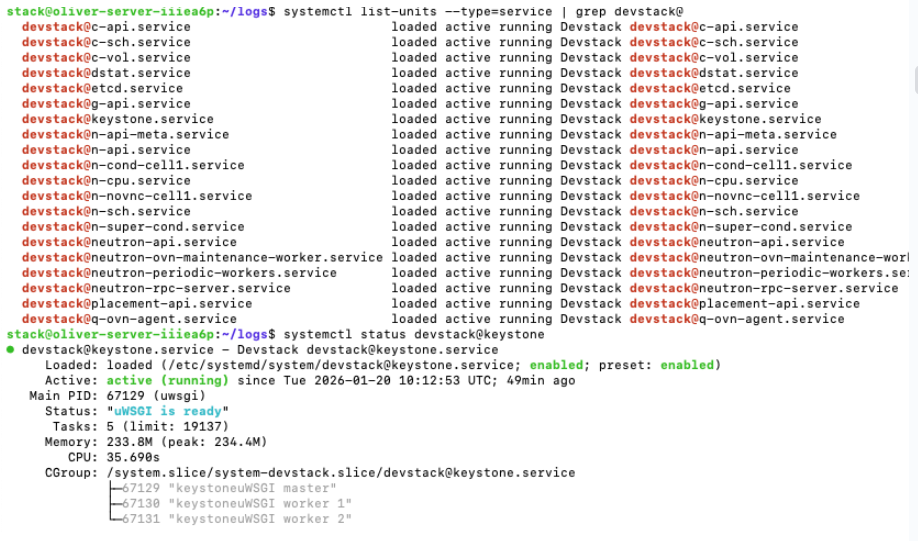

### Component Log Inspection

#### Keystone

```bash
sudo journalctl -u devstack@keystone -n 50 --no-pager
```

#### Nova

```bash
sudo journalctl -u devstack@n-api -n 10 --no-pager
sudo journalctl -u devstack@n-sch -n 10 --no-pager
sudo journalctl -u devstack@n-cpu -n 10 --no-pager
```

#### Neutron

```bash
sudo journalctl -u devstack@q-svc -n 10 --no-pager
sudo journalctl -u devstack@q-agt -n 10 --no-pager
sudo journalctl -u devstack@q-l3 -n 10 --no-pager
```

### OpenStack CLI Validation

Load admin credentials:

```bash
source /opt/stack/devstack/openrc admin admin
```

Check the loaded environment variables to confirm if the exported credentials are loaded.

```bash
env | grep OS
```

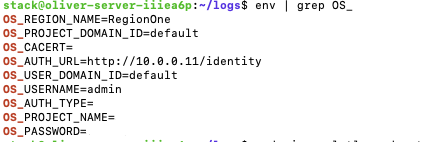

Verify services and endpoints

```bash
openstack service list
openstack endpoint list
```

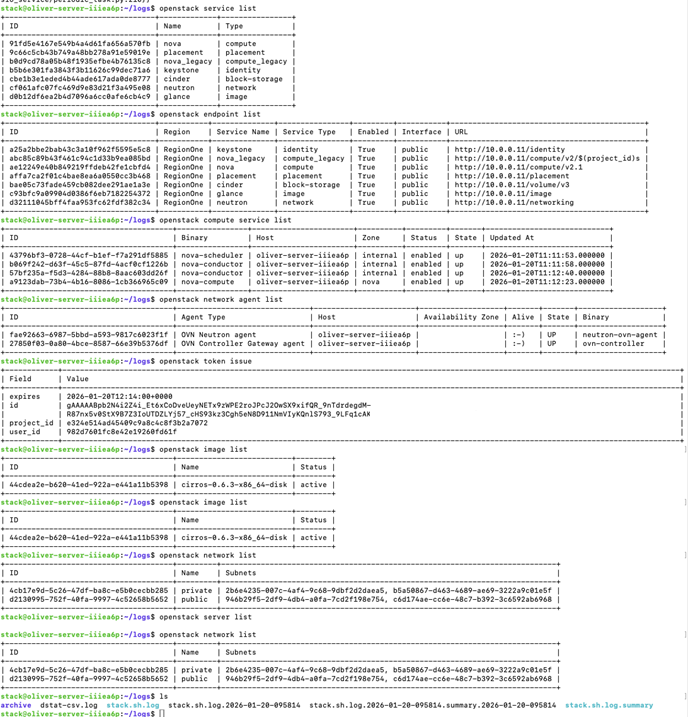

## Deployment of a Virtual Machine

### Authentication

```bash
source /opt/stack/devstack/openrc admin admin
openstack token issue
```

### Image Creation

List available images:

```bash
openstack image list
```

Create an image if none exist:

```bash
openstack image create --disk-format qcow2 --container-format bare --public --file /opt/stack/devstack/files/cirros-*.qcow2  cirros
```

### Flavor Creation

List flavors:

```bash
openstack flavor list
```

Create a flavor:

```bash
openstack flavor create --ram 512 --disk 1 --vcpus 1 m1.tiny
```

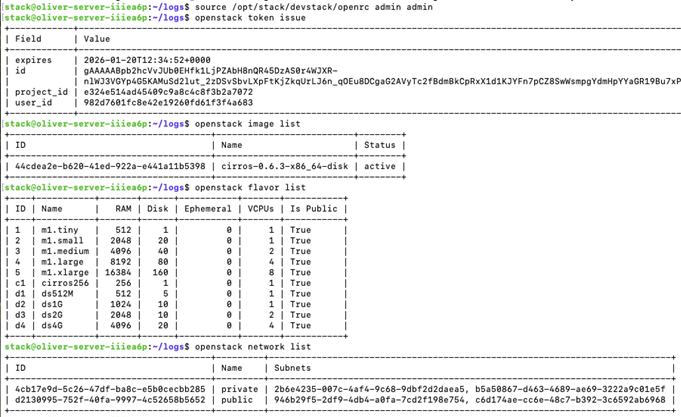

### Key Pair Creation

If both image and flavor are available, create a keypair in OpenStack with which the VM will be created. This will be used to authenticate via SSH when connecting to the VM.

Create a key pair:

```bash
openstack keypair create tiny-key > tiny-key.pem
```

Created a key named “tiny-key” and saved in tiny-key.pem

Restrict permissions:

Edit the permission of the key to give read & write access to only the user, with both group and other having no access. Without this modification, the key would be rejected by SSH.

```bash
chmod 600 tiny-key.pem
```

### Security Group Check

```bash
openstack project list
openstack security group list --project admin
openstack security group list
```

### Security Group Configuration

Allow SSH access:

Use the ID to ensure specificity as in the below, albeit the name can be used if there is only one group with that name.

```bash
openstack security group rule create --protocol tcp --dst-port 22 f09c74d6-dc67-4a70-85d2-1e4fe1c0dcc6
```

Allow ICMP traffic:

```bash
openstack security group rule create --protocol icmp f09c74d6-dc67-4a70-85d2-1e4fe1c0dcc6
```

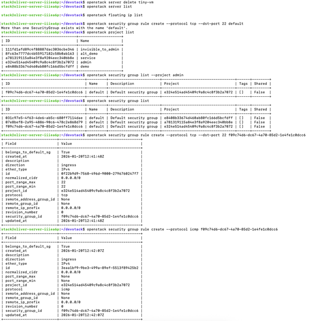

### VM Creation

Now, create the VM with image & flavor of choice and the key generated, connected to the private network:

```bash
openstack server create --image cirros-0.6.3-x86_64-disk  --flavor m1.tiny --key-name tiny-key --network private tiny-vm
```

Verify VM status:

```bash
openstack server list
openstack server show tiny-vm
```

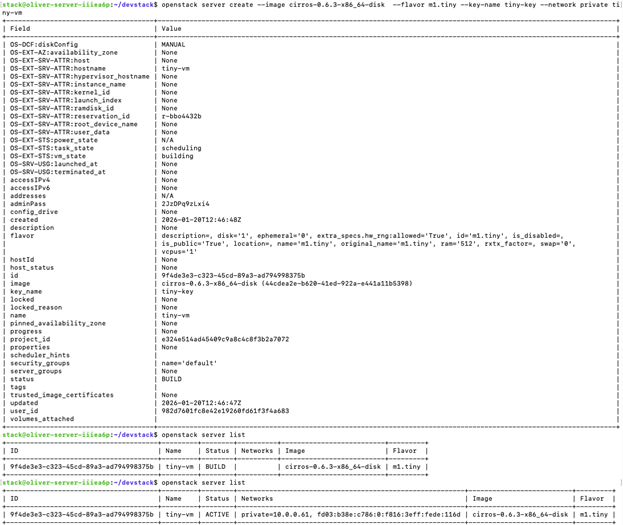

### Floating IP Creation

**Note:**
If a VM is created directly on a **public network**, a floating IP is not required. It can be accessed on the public IP but the security must be set to allow connection to the IP.

The below VM was created on a public network hence there was no need to create a floating IP for it.

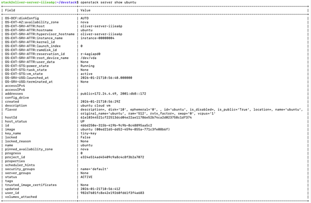

The same public IP 172.24.4.49 was used to access it.

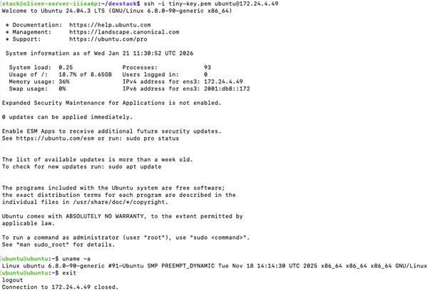

When the VM is created on private network, it must have a public IP associated to it. Hence a floating IP must be created, to be used to access it.

Create a floating IP:

```bash
openstack floating ip create public
```

Attach it to the VM:

```bash
openstack server add floating ip tiny-vm 172.24.4.55
```

Check connectivity:

```bash
ping 172.24.4.55
ssh -i tiny-key.pem cirros@172.24.4.55
```

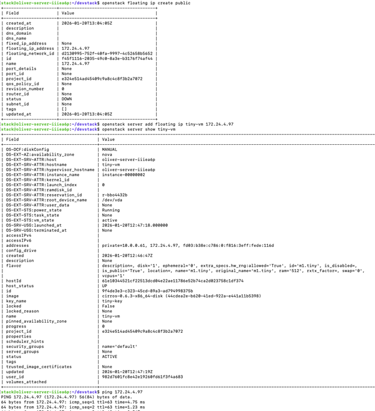

---

## Architecture Diagram

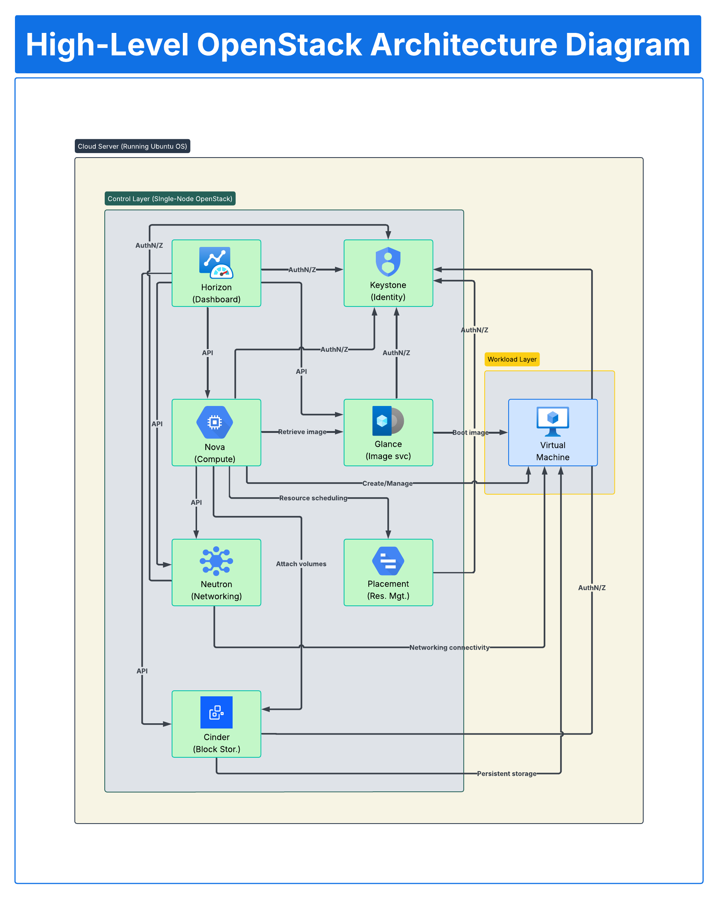

## References

- [OpenStack Logical Architecture](https://docs.openstack.org/arch-design/design.html)
- [Conceptual architecture](https://docs.openstack.org/install-guide/get-started-conceptual-architecture.html)
- [Canonical OpenStack architecture](https://canonical.com/openstack/architecture)
- [Red Hat OpenStack Platform](https://docs.redhat.com/en/documentation/red_hat_openstack_platform/10/html-single/architecture_guide/index)
